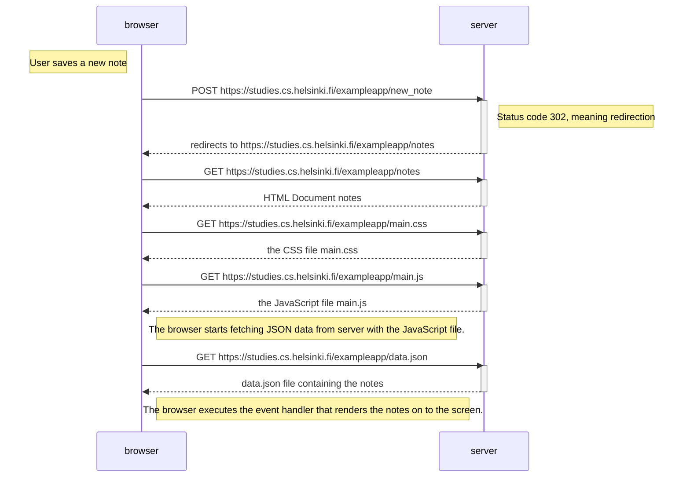

```mermaid
sequenceDiagram
    participant browser
    participant server

    Note left of browser: User saves a new note

    browser->>server: POST https://studies.cs.helsinki.fi/exampleapp/new_note
    activate server
    Note right of server: Status code 302, meaning redirection
    server-->>browser: redirects to https://studies.cs.helsinki.fi/exampleapp/notes
    deactivate server

    browser->>server: GET https://studies.cs.helsinki.fi/exampleapp/notes
    activate server
    server-->>browser: HTML Document notes
    deactivate server

    browser->> server: GET https://studies.cs.helsinki.fi/exampleapp/main.css
    activate server
    server-->>browser: the CSS file main.css
    deactivate server

    browser->>server: GET https://studies.cs.helsinki.fi/exampleapp/main.js
    activate server
    server-->>browser: the JavaScript file main.js
    deactivate server

    Note right of browser: The browser starts fetching JSON data from server with the JavaScript file.

    browser->>server: GET https://studies.cs.helsinki.fi/exampleapp/data.json
    activate server
    server-->>browser: data.json file containing the notes
    deactivate server

    Note right of browser: The browser executes the event handler that renders the notes on to the screen.
```
