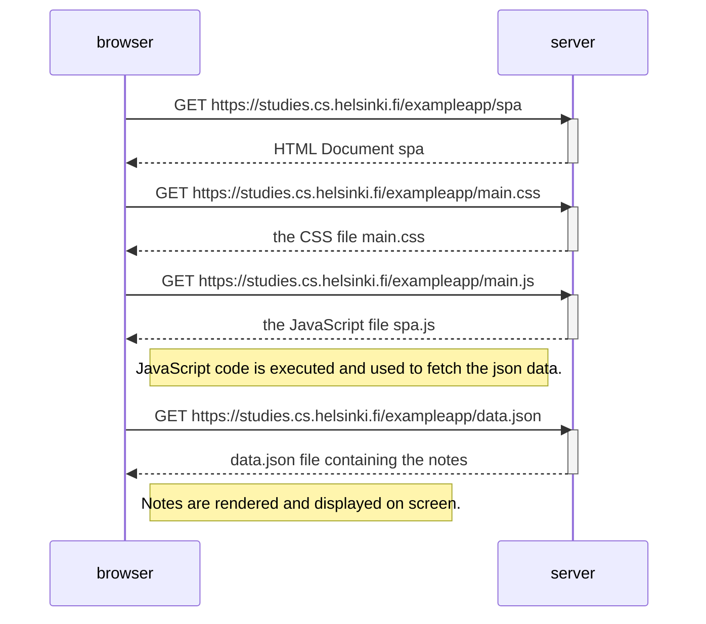

```mermaid
sequenceDiagram
    participant browser
    participant server

    browser->> server: GET https://studies.cs.helsinki.fi/exampleapp/spa
    activate server
    server-->>browser: HTML Document spa
    deactivate server

    browser->> server: GET https://studies.cs.helsinki.fi/exampleapp/main.css
    activate server
    server-->>browser: the CSS file main.css
    deactivate server

    browser->> server: GET https://studies.cs.helsinki.fi/exampleapp/main.js
    activate server
    server-->>browser: the JavaScript file spa.js
    deactivate server

    Note right of browser: JavaScript code is executed and used to fetch the json data.

    browser->> server: GET https://studies.cs.helsinki.fi/exampleapp/data.json
    activate server
    server-->>browser: data.json file containing the notes
    deactivate server

    Note right of browser: Notes are rendered and displayed on screen.
```