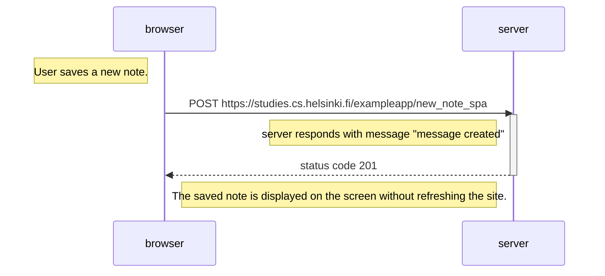

```mermaid
sequenceDiagram
    participant browser
    participant server

    Note left of browser: User saves a new note.

    browser->> server: POST https://studies.cs.helsinki.fi/exampleapp/new_note_spa
    activate server
    Note left of server: server responds with message "message created"
    server-->>browser: status code 201
    deactivate server

    Note right of browser: The saved note is displayed on the screen without refreshing the site.
```